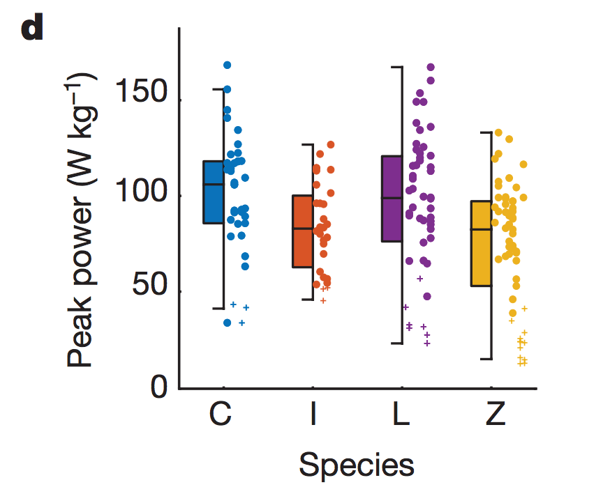

---
## Introduction
We will be looking at data from Figure 2D of a [2018 Nature publication](https://www.nature.com/articles/nature25479) titled,"Biomechanics of predator–prey arms
race in lion, zebra, cheetah and impala" by Wilson *et al.*

You can download the data directly from the publication website or within this Github repository. We will be walking through the generation of the plots shown on the cheatsheet. The final product will be the (nearly) reproduced figure 2D from the publication and our own version of it.

Let's see if we can reproduce or improve upon Figure 2D:


### Setting up the workspace
We set a default for the notebook to echo code and load in the *tidyverse* package, which includes a whole group necessary and also unecessary packages.
```R {r echo = TRUE, results = "hide"}
knitr::opts_chunk$set(echo = TRUE)
library(viridis)
library(tidyverse)
```

### Load in data
We load in the data and check out what it looks like.
```R
raw_data <- read.table("nature25479_f2_formatted.csv", header = TRUE, sep=",", stringsAsFactors = FALSE)
summary(raw_data)
```

```{r echo=TRUE}
head(raw_data, n = 5)
```

From the raw data, we can group it by species then summarize the key statistics we define using R pipes.
```R
summary_data <- raw_data %>%
  group_by(Species) %>%
  summarize(
    N = length(Peak_Power),
    mean = mean(Peak_Power),
    sd = sd(Peak_Power),
    se = sd / sqrt(N)
  )

head(summary_data, n = 4)
```

## Setting up the basic ggplot object
We set up a ggplot object using our summary
```{r}
i1 <- ggplot(data = summary_data, aes(x = Species, y = mean)) +
  geom_col() + geom_errorbar(aes(ymin = mean - se, ymax = mean + se))

i1
```
This default plot definitely doesn't look great. Let's set the ggplot theme to something to start us off and resize + color these bars.
```{r}
theme_set(theme_classic())
i2 <- ggplot(data = summary_data, aes(x = Species, y = mean, fill = Species)) +
  geom_col(width = 0.5, alpha = 0.8) +
  geom_errorbar(aes(ymin = mean - se, ymax = mean + se), size = 0.75, width = 0.1) +
  scale_fill_viridis(discrete = TRUE, alpha = 0.8, end = 0.75, option = "viridis")

i2
```
We map the fill to species as well, decrease the width of the bars, and make them slightly transparent. For the error bars, we also decrease the width. To give them color, we use `scale_fill_viridis` to implement the Viridis color scheme on our bars.
It looks better, but we have this weird gap between the bars and x-axis. The legend is not necessary and the y-axis title is not declarative.

```{r}
i3 <-  ggplot(data = summary_data, aes(x = Species, y = mean, fill = Species)) +
  geom_col(width = 0.5, alpha = 0.8) +
  geom_errorbar(aes(ymin = mean - se, ymax = mean + se), size = 0.75, width = 0.1) +
  scale_fill_viridis(guide = FALSE, discrete = TRUE, alpha = 0.8, end = 0.75, option = "viridis") +
  labs(x = "Species", y = bquote("Peak Power (W" ~kg^-1 ~ ")")) +
  scale_y_continuous(expand = c(0, 0), limits = c(0, 120)) +
  theme(
    axis.title = element_text(size = rel(1.25)),
    axis.text.x = element_text(color = "black", margin = margin(t = 5), size = rel(1.5)),
    axis.text.y = element_text(color = "black", margin = margin(r = 5), size = rel(1.5)))

i3
```

We removed the legend, fixed the scaling of the bars, and added a declarative y-axis title label. It's looking much better, but let's take it up a notch by improving its readability and adding points. We should always show the points for bar graphs.

```{r}
i4 <- ggplot(data = summary_data, aes(x = Species, y = mean, fill = Species)) +
  geom_col(color = "black", width = 0.4, alpha = 0.6) +
  geom_errorbar(aes(ymin = mean - se, ymax = mean + se), size = 0.75, width = 0.1) +
  geom_point(data = raw_data, aes(x = Species, y = Peak_Power, color = Species, shape = Species), size = 3,
             position = position_jitter(width = 0.1)) +
  scale_color_viridis(guide = FALSE, discrete = TRUE, alpha = 0.8, end = 0.75, option = "viridis") +
  scale_shape_manual(values=c(21, 22, 23, 25), guide = FALSE) +
  scale_fill_viridis(guide = FALSE, discrete = TRUE, alpha = 0.8, end = 0.75, option = "viridis") +
  scale_y_continuous(expand = c(0, 0), limits = c(0, 190)) +
  scale_x_discrete(name = "Species", limits = c("Zebra", "Lion", "Impala", "Cheetah"),
                   labels = c("Cheetah" = "Cheetah", "Impala" = "Impala", "Lion" = "Lion", "Zebra" = "Zebra"))


i4 <- i4 +
  labs(x = "Species", y = bquote(bold("Peak Power (W" ~kg^-1 ~ ")"))) +
  coord_flip() + theme(
    axis.title.x = element_text(face = "bold", margin = margin(t = 10), size = rel(1.5)),
    axis.title.y = element_text(face = "bold", size = rel(1.25), angle = 0, vjust = 0.5),
    axis.text.x = element_text(color = "black", margin = margin(t = 5), size = rel(1.75)),
    axis.text.y = element_text(color = "black", margin = margin(r = 5), size = rel(1.75)),
    axis.line = element_line(size = 1),
    axis.ticks.length = unit(10, "pt"),
    axis.ticks = element_line(size  = 1),
    axis.ticks.y = element_blank())

i4
```
We do a lot here, but it's all aesthetics. We add points with different shapes and matching colors, which shows that our bar graph made a wrong impression about the range of peak power. We turn the graph horizontal, making it easier to understand the species labels. We thicken the axes and add an outline to our bars. We remove the species tick marks and thicken the peak power tick marks to reduce clutter and sharpen focus. It looks like a nice graph now, but with this many points, we should switch to a boxplot or violin plot. Let's try those out.

```{r}
i5 <- ggplot(data = raw_data, aes(x = Species, y = Peak_Power, fill = Species, shape = Species)) +
  geom_boxplot(outlier.shape = NA, varwidth = TRUE, notch = TRUE, coef = 1.5,
               width = 0.4, color = "black", alpha = 0.6) +
  geom_point(size = 3, position = position_jitter(width = 0.1)) +
  scale_fill_viridis(guide = FALSE, discrete = TRUE, alpha = 0.8, end = 0.75, option = "viridis") +
  scale_shape_manual(values=c(21, 22, 23, 25), guide = FALSE) +
  scale_y_continuous(expand = c(0, 0), limits = c(0, 190)) +
  scale_x_discrete(name = "Species", limits = c("Zebra", "Lion", "Impala", "Cheetah"),
                   labels = c("Cheetah" = "Cheetah", "Impala" = "Impala", "Lion" = "Lion", "Zebra" = "Zebra"))

i5 <- i5 +
  labs(x = "Species", y = bquote(bold("Peak Power (W" ~kg^-1 ~ ")"))) +
  coord_flip() +
  theme(
    axis.title.x = element_text(face = "bold", margin = margin(t = 10), size = rel(1.5)),
    axis.title.y = element_text(face = "bold", size = rel(1.25), angle = 0, vjust = 0.5),
    axis.text.x = element_text(color = "black", margin = margin(t = 5), size = rel(1.75)),
    axis.text.y = element_text(color = "black", margin = margin(r = 5), size = rel(1.75)),
    axis.line = element_line(size = 1),
    axis.ticks.length = unit(10, "pt"),
    axis.ticks = element_line(size  = 1),
    axis.ticks.y = element_blank())

i5
```

By simply changing `geom_col` to `geom_boxplot`, we can display a boxplot with the same mappings, data, and aesthetic manipulations. We add notches into our boxplot to show an approximate 95% confidence interval for medians (`1.58 * IQR / sqrt(n)`).
Let's see what a violin plot looks like.

```{r}
i6 <- ggplot(data = raw_data, aes(x = Species, y = Peak_Power, fill = Species, shape = Species)) +
  geom_violin(draw_quantiles = c(0.5), color = "black", alpha = 0.6) +
  geom_point(size = 3, position = position_jitter(width = 0.1)) +
  scale_fill_viridis(guide = FALSE, discrete = TRUE, alpha = 0.8, end = 0.75, option = "viridis") +
  scale_shape_manual(values=c(21, 22, 23, 25), guide = FALSE) +
  scale_y_continuous(breaks = c(25, 50, 75, 100, 125, 150), expand = c(0, 0), limits = c(0, 190)) +
  scale_x_discrete(name = "Species", limits = c("Zebra", "Lion", "Impala", "Cheetah"),
                   labels = c("Cheetah" = "Cheetah", "Impala" = "Impala", "Lion" = "Lion", "Zebra" = "Zebra"))

i6 <- i6 +
  labs(x = "Species", y = bquote(bold("Peak Power (W" ~kg^-1 ~ ")"))) +
  coord_flip() +
  theme(
    axis.title.x = element_text(face = "bold", margin = margin(t = 10), size = rel(1.5)),
    axis.title.y = element_text(face = "bold", size = rel(1.25), angle = 0, vjust = 0.5),
    axis.text.x = element_text(color = "black", margin = margin(t = 20), size = rel(1.75)),
    axis.text.y = element_text(color = "black", margin = margin(r = 20), size = rel(1.75)),
    axis.line = element_line(size = rel(1.5)),
    axis.ticks.length = unit(-7.5, "pt"),
    axis.ticks = element_line(size = rel(1.5)),
    axis.ticks.y = element_blank(),
    panel.grid.major.x = element_line(color = "grey90", size = rel(0.5)))

i6
```
This violin plot also does a great job of showing the distribution. We turned the axis tick marks inwards and added major light grey grid lines - completely optional, but it makes following the peak power values for all the different violin plots. This is a polished product. Now, let's revisit the initial figure. This data is from Figure 2D, so let's see how close we can get to replicating that.

```{r}
cmap <- c("#4473B0", "#C15436", "#6E348C", "#E4AC43")

r <- ggplot(data = raw_data, aes(x = Species, y = Peak_Power, fill = Species, color = Species)) +
  geom_boxplot(outlier.shape = NA, varwidth = FALSE, notch = FALSE, coef = 10, width = 0.4,
               lwd = rel(1), fatten = rel(1), color = "black") +
  scale_y_continuous(expand = c(0, 0), limits = c(0, 190)) +
  scale_fill_manual(values = cmap, guide = FALSE) +
  geom_point(size = 3, stroke = 0, position = position_jitterdodge(jitter.width = 0.2, seed = 7)) +
  scale_color_manual(values = cmap, guide = FALSE) +
  scale_x_discrete(name = "Species", limits = c("Cheetah", "Impala", "Lion", "Zebra"),
                   labels = c("Cheetah" = "C", "Impala" = "I", "Lion" = "L", "Zebra" = "Z"))
r <- r +
  labs(x = "Species", y = bquote("Peak Power (W" ~kg^-1 ~ ")")) +
  theme(
    axis.title = element_text(size = rel(2)),
    axis.title.x = element_text(margin = margin(t = 25)),
    axis.title.y = element_text(margin = margin(r = 25)),
    axis.text.x = element_text(color = "black", margin = margin(t = 10), size = rel(2)),
    axis.text.y = element_text(color = "black", margin = margin(r = 10), size = rel(2)),
    axis.ticks.length = unit(-2, "pt"),
    axis.line = element_line(size = rel(2)))
r
```

The road ends here for R. We pulled their color scheme from the paper, plotted boxplots with a thick outline and solid points. The tick marks are turned inwards and shrunken. After exporting as .svg in the right aspect ratio, we can nudge the points over and modify the box whiskers. All-in-all, the plot is reproducibly reproduced and gets the message across.
